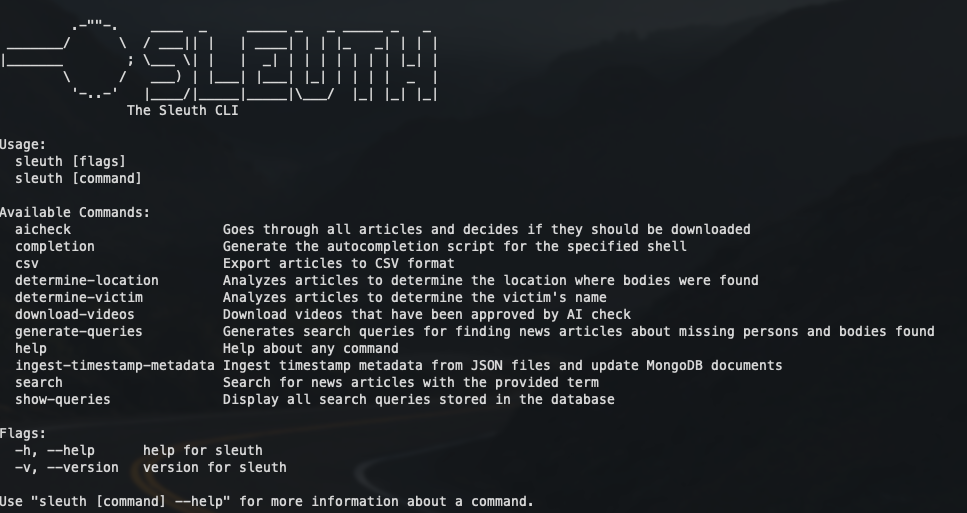

# Sleuth

Sleuth is a pipeline of tools for the analysis of News footage. It is designed to find multimedia content across various news sources, "providers", extract metadata, download the content, and ultimately create a dataset of news footage focused around murder and bodies found for further forensic analysis.



### Prerequisite:
- This project assumes that you have installed Ollama and Llama3.1 8B locally and have it running.
- You can download Ollama from their Github repo: https://github.com/ollama/ollama
- Then install Llama3.1 8B or other versions by running
```shell
ollama run llama3.1 # will download if the first time
ollama serve # this will start the Ollama server on port 11434
```
### Installation:
- Build Sleuth CLI (with Golang installed) (`./build/build.sh`) - optional if `sleuth` executable file exists.
- Python 3.11 (`brew install python@3.11`)
- ffmpeg (`brew install ffmpeg`)

- Create a virtual environment

```bash
python3.11 -m venv venv
```

- Activate the virtual environment (MacOS/Linux)

```bash
source venv/bin/activate
```

- Upgrade pip version (optional)

```bash
pip install --upgrade pip
```

- Install the dependencies

```bash
pip install -r requirements.txt
```

# Overall Pipeline:
- Search for articles using keywords, for example `"body found"`
```shell
# Starting the DB and Docker - optional, you can use a different connection string without docker
export MONGODB_URI="mongodb://localhost:9000/?directConnection=true"
docker compose up -d

# Obtain articles metadata
./sleuth search -q "murder cases"
```

- Perform AI check and download videos to `/downloads` folder
```shell
./sleuth aicheck
./sleuth download-videos
```

- Get the transcription and find relevant timestamps where they discuss body discovery. This will create 2 folders, `/audios` containing corresponding audio files, and `/timestamps` containing extracted JSON of relevant timestamps.
```shell
python audio-extraction/pipeline.py
./sleuth ingest-timestamp-metadata  # this will update the DB records with the relevantTimestamps
```

- Case Grouping:
```shell
./sleuth determine-location     # determine case location if possible
./sleuth determine-victim       # determine victim names if possible

python clustering/updated_pipeline.py   # embed the data and group cases using HDBScan
python clustering/visualize_clusters.py --html clustering/clusters.html # output an interactive visualization of clusters
```

# Sleuth CLI

The sleuth CLI is responsible for searching various news providers for multimedia content to be further processed.

## Building

To build, install golang on your system and run `./build/build.sh`. This script will output the sleuth CLI into the root of the project.

After it's built, you can execute like this:

```
./sleuth search -q "murder cases"
```

## Starting the database

From the root directory, run

```shell
docker compose up -d
```

Connecting to the mongo database can be done via tools like [MongoDB Compass](https://www.mongodb.com/products/tools/compass) or using `mongosh`

e.g. `mongosh mongodb://localhost:9000/?directConnection=true`

The default connection string is above, but can be overriden like so:

```shell
export MONGODB_URI="mongodb://localhost:9000/?directConnection=true"
```

## Running without building first

### Searching (adding to dataset)

```shell
go run cmd/sleuth/main.go search -q "body found"
```

### AI Check

AI Check will determine if the video should be downloaded using llama LLM

```shell
go run cmd/sleuth/main.go aicheck
```

### CSV

CSV will export the dataset to CSV format, by default to standard out, you can also use `-o` flag to print it to a specified file.

```shell
go run cmd/sleuth/main.go csv
```

or

```
go run cmd/sleuth/main.go csv -o output.csv
```

### Show Queries

```
# Show all queries
./sleuth show-queries

# Show only unused queries
./sleuth show-queries --unused

# Get JSON output
./sleuth show-queries --json

# Save results to a file
./sleuth show-queries -o queries.txt

# Combine flags
./sleuth show-queries --unused --json -o unused-queries.json
```

# Python Components
## Audio Transcription

### Usage:

Run the audio processing script (this will detect the relevant timestamps from the extracted audio files and save them as `.json` in the `timestamps` folder)

```bash
python audio-extraction/pipeline.py
```

## Clustering

If you run the clustering application at [./clustering/main.py](./clustering/main.py), it will add a `clusterId`, `clusterConf`, and `embed` field to every mongo document in the `articles` collection. The clustering process utilizes HDBSCAN for grouping similar articles based on their embeddings. The embeddings are generated using the `sentence-transformers` library, specifically the `all-mpnet-base-v2` model.

Documents with the same cluster id should be similar in content.

### Usage

```shell
python clustering/updated_pipeline.py
```

Visualizing the clusters can be done using 
```shell
python clustering/visualize_clusters.py --html clustering/clusters.html
```
then opening `clustering/clusters.html` in a web browser.
